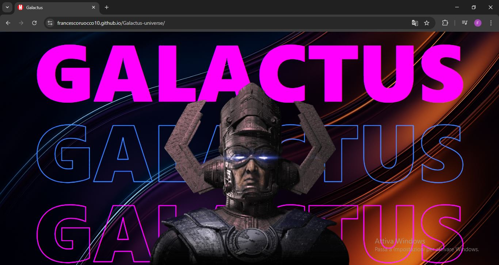

#  Galactus 

## Descrizione
Un’esperienza visiva ispirata all’universo di Galactus: solo grafica, colore e design per passione.

## Caratteristiche principali
- Arte digitale originale: immagini e composizioni create per esprimere l’universo di Galactus.
- Colori e tipografia audaci: design visivamente potente e d’impatto.
-  Esperimento creativo: progetto personale realizzato per passione e sperimentazione.
- Focus sull’estetica: solo design e grafica, senza funzionalità web reali.
- Coinvolgimento visivo: gioco di layering, effetti luce e contrasto per attirare l’occhio.

## Struttura del progetto
◻ `App.jsx`: componente principale che mostra lo sfondo e centra i componenti GalactusText e GalactusImage nella pagina.;

◻ `Image.jsx` (o `GalactusImage`): componente che mostra solo l'immagine di Galactus;

◻ `Text.jsx` (o `GalactusText`): componente che mostra i titoli GALACTUS;

## Tecnologie utilizzate
- JavaScript, CSS
- React
